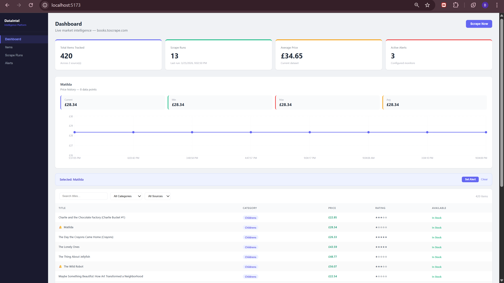
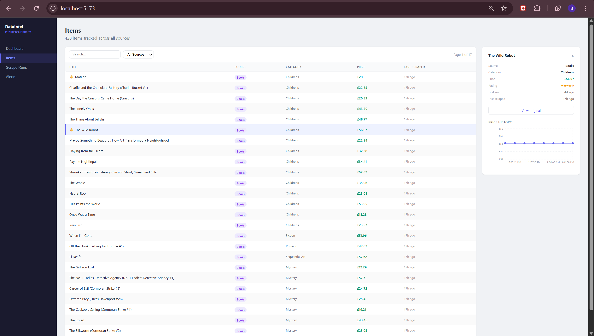
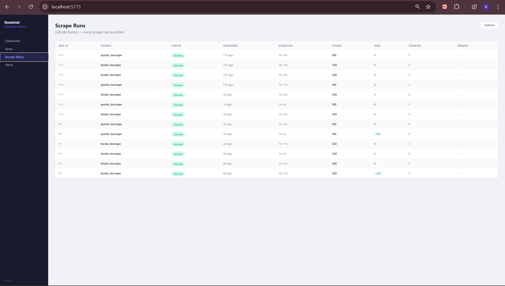
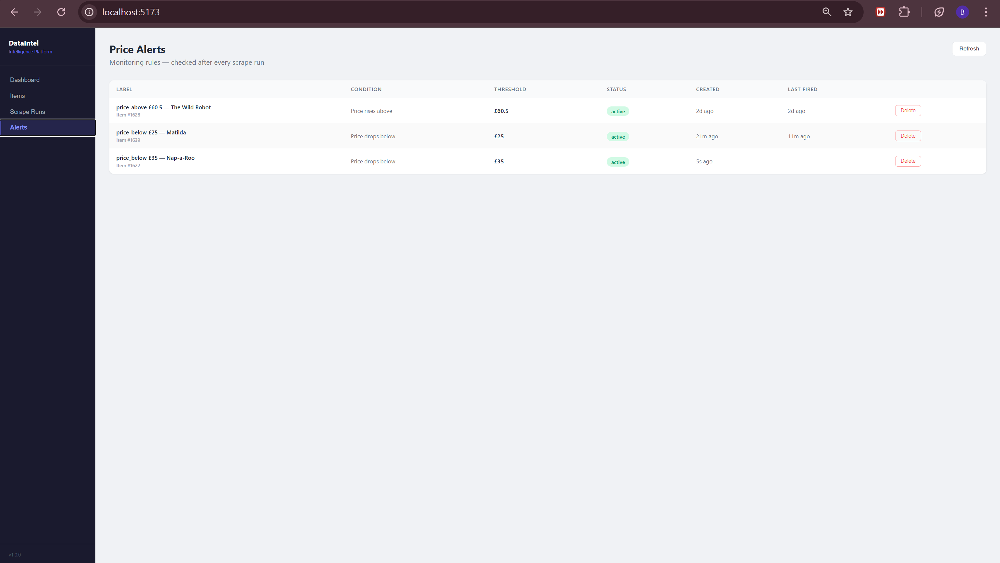

# DataIntel — Automated Data Intelligence Platform

> Automatically collect, process, and monitor data from any website — with real-time price alerts, trend analytics, and a professional dashboard.


---

## What This Is

DataIntel is a full-stack data scraping and analytics platform that simulates real business intelligence use cases — competitor price tracking, market monitoring, and automated data collection.

Point it at any website. It scrapes the data on a schedule, runs it through a cleaning pipeline, stores it with full history, and surfaces it in a dashboard with filtering, trend charts, and price alerts.

**The business pitch:** Companies spend hours manually checking competitor prices and market data. DataIntel automates that entirely — and notifies you the moment something changes.

---

## Screenshots

### Dashboard — Live summary cards, price trend chart, and filterable data table


### Items — Full detail view with metadata panel and price history


### Scrape Runs — Job health monitoring with timing and outcome data


### Price Alerts — Create and manage monitoring rules per item


---

## Features

**Data Collection**
- Scrapes static HTML pages with httpx + BeautifulSoup
- Handles JavaScript-rendered pages with Playwright (full browser automation)
- Anti-detection: rotating User-Agents, randomized delays, robots.txt compliance, exponential backoff retries
- Supports multiple data sources simultaneously
- Automatic pagination handling and infinite scroll support

**Data Processing**
- 4-stage pipeline: validate → clean → deduplicate → normalize
- Unicode normalization (fixes encoding artifacts like `£` → `£`)
- Deterministic item IDs via SHA-256 hashing for stable cross-run deduplication
- Pure functions — pipeline is fully testable with no database dependency

**Historical Tracking**
- Append-only `price_snapshots` table — one row per scrape per item, never updated
- Price change percentage computed automatically on every update
- Full trend history queryable via window functions (`LAG()`, `ROW_NUMBER()`)
- Powers time-series charts with real historical data points

**Automation**
- APScheduler with SQLite persistence — jobs survive application restarts
- Configurable scrape intervals per source
- Manual trigger available via API and dashboard button
- Every job logged with start time, duration, items found, items new, items updated, error count

**Alert System**
- Per-item monitoring rules: price below threshold, price above threshold, price drop by percentage
- Alert evaluation runs automatically after every scrape
- Full fired-alert history recorded in the database
- Email notifications via SMTP (Gmail compatible)

**REST API**
- Full Swagger UI at `/docs`
- Paginated item listing with search, source filter, and category filter
- Price trend endpoint returning time-series data for charts
- Dashboard summary endpoint with pre-aggregated analytics
- Manual scrape trigger endpoint
- Full CRUD for alerts

**React Dashboard**
- 4 live summary cards (total items, scrape runs, avg price, active alerts)
- Searchable, filterable, paginated data table with price change badges
- Price trend line chart — click any item to see its history
- Multi-source filtering with dynamic category detection
- Live "Scrape Now" button with spinner and status feedback
- Scrape runs history page with color-coded status badges
- Items detail page with full metadata panel and mini chart
- Alerts page — create, view, delete monitoring rules
- Bell indicator on items with active alerts

---

## Tech Stack

| Layer | Technology |
|---|---|
| Language | Python 3.11 |
| API Framework | FastAPI |
| ORM | SQLAlchemy 2.0 (async) |
| Database | PostgreSQL 16 |
| Async Driver | asyncpg |
| HTTP Client | httpx |
| HTML Parser | BeautifulSoup4 + lxml |
| Browser Automation | Playwright (Chromium) |
| Data Processing | Pandas |
| Scheduling | APScheduler |
| Validation | Pydantic v2 |
| Frontend | React 18 + Vite |
| Charts | Recharts |
| API Client | Axios |
| Containerization | Docker |

---

## Architecture

```
┌─────────────────────────────────────────┐
│           APScheduler                   │
│   Triggers scrape jobs on intervals     │
└──────────────────┬──────────────────────┘
                   │
┌──────────────────▼──────────────────────┐
│           Scraper Engine                │
│  StaticScraper (httpx + BS4)            │
│  DynamicScraper (Playwright)            │
│  Source subclasses (books, quotes...)   │
└──────────────────┬──────────────────────┘
                   │
┌──────────────────▼──────────────────────┐
│         Processing Pipeline             │
│  validate → clean → deduplicate →       │
│  normalize                              │
└──────────────────┬──────────────────────┘
                   │
┌──────────────────▼──────────────────────┐
│            PostgreSQL                   │
│  items · price_snapshots · scrape_runs  │
│  sources · alerts · alert_events        │
└──────────────────┬──────────────────────┘
                   │
┌──────────────────▼──────────────────────┐
│           FastAPI REST API              │
│  /items · /analytics · /scrape ·        │
│  /alerts                                │
└──────────────────┬──────────────────────┘
                   │
┌──────────────────▼──────────────────────┐
│          React Dashboard                │
│  Dashboard · Items · Runs · Alerts      │
└─────────────────────────────────────────┘
```

---

## Database Schema

```
sources          — registered data sources
items            — one row per tracked entity, current state denormalized
price_snapshots  — append-only time-series, one row per scrape per item
scrape_runs      — full metadata for every job execution
alerts           — user-configured monitoring rules
alert_events     — complete fired alert history
```

The key design decision: `items` holds the current state for fast dashboard queries, while `price_snapshots` holds the full immutable history for trend analytics. Never update snapshots — only insert.

---

## Data Sources

| Source | Data Type | Items | Scrape Interval |
|---|---|---|---|
| books.toscrape.com | Product prices + ratings | 320 | Every 6 hours |
| quotes.toscrape.com | Quotes + authors + tags | 100 | Every 6 hours |

Adding a new source takes one file (~60 lines) in `backend/scrapers/sources/`. The pipeline, database, API, and dashboard all work automatically.

---

## Local Setup

### Prerequisites

- Python 3.11
- Node.js 18+
- Docker Desktop

### 1. Clone and set up the backend

```bash
git clone https://github.com/BadrDyane/data-intelligence-platform.git
cd data-intelligence-platform

# Create virtual environment (use Python 3.11 specifically)
py -3.11 -m venv .venv

# Activate (Windows)
.venv\Scripts\Activate.ps1

# Activate (Mac/Linux)
source .venv/bin/activate

# Install dependencies
pip install -r requirements.txt

# Install Playwright browser
playwright install chromium
```

### 2. Start PostgreSQL

```bash
docker compose up -d postgres
```

### 3. Configure environment

```bash
cp .env.example .env
# Edit .env if needed — defaults work out of the box with docker-compose
```

### 4. Start the API

```bash
uvicorn backend.api.main:app --reload --host 0.0.0.0 --port 8000
```

API docs available at `http://localhost:8000/docs`

### 5. Start the frontend

```bash
cd frontend
npm install
npm run dev
```

Dashboard available at `http://localhost:5173`

### 6. Run your first scrape

Click **Scrape Now** in the dashboard, or call:

```bash
POST http://localhost:8000/api/v1/scrape
{"source": "books_toscrape"}
```

---

## API Reference

| Method | Endpoint | Description |
|---|---|---|
| GET | `/api/v1/items` | Paginated items with search + filters |
| GET | `/api/v1/items/{id}` | Single item detail |
| GET | `/api/v1/items/{id}/trend` | Price history for charts |
| GET | `/api/v1/analytics/summary` | Dashboard summary numbers |
| GET | `/api/v1/analytics/runs` | Scrape run history |
| POST | `/api/v1/scrape` | Trigger manual scrape |
| GET | `/api/v1/alerts` | List active alerts |
| POST | `/api/v1/alerts` | Create price alert |
| DELETE | `/api/v1/alerts/{id}` | Delete alert |

---

## Adding a New Data Source

```python
# backend/scrapers/sources/my_source.py

from backend.scrapers.static_scraper import StaticScraper
from backend.scrapers.base_scraper import ScrapedItem, ScrapeResult

class MySourceScraper(StaticScraper):
    def __init__(self):
        super().__init__("my_source", "https://example.com")

    async def scrape_page(self, url, page_num=1):
        html = await self._get(url)
        soup = self.parse_html(html)
        # parse items...
        return items

    async def scrape_all(self):
        result = ScrapeResult(source=self.source_name)
        # orchestrate pagination...
        return result
```

Then register in `backend/scheduler/jobs.py`:

```python
SCRAPER_REGISTRY = {
    "books_toscrape":  BooksToScrapeScraper,
    "my_source":       MySourceScraper,   # add this
}
```

That's it. The pipeline, database, API, and dashboard handle the rest automatically.

---

## Environment Variables

| Variable | Default | Description |
|---|---|---|
| `DATABASE_URL` | postgresql+asyncpg://... | PostgreSQL connection string |
| `SCRAPE_DELAY_MIN` | 1.5 | Min seconds between requests |
| `SCRAPE_DELAY_MAX` | 3.5 | Max seconds between requests |
| `SCRAPE_TIMEOUT` | 30 | HTTP timeout in seconds |
| `SCRAPE_MAX_RETRIES` | 3 | Retry attempts on failure |
| `PLAYWRIGHT_HEADLESS` | True | Set False to watch the browser |
| `SCHEDULER_ENABLED` | True | Enable automatic scraping |
| `DEFAULT_SCRAPE_INTERVAL_HOURS` | 6 | Hours between auto-scrapes |
| `ALERT_EMAIL_ENABLED` | False | Enable email notifications |
| `SMTP_USER` | — | Gmail address for sending alerts |
| `SMTP_PASS` | — | Gmail app password |

---

## Business Use Cases

| Industry | Application |
|---|---|
| E-commerce | Monitor competitor prices on Amazon, eBay, any store |
| Real estate | Track property listing prices by neighborhood |
| Job market | Aggregate job listings and salary benchmarks |
| Finance | Monitor stock screener data and market metrics |
| Retail | Track product availability and restocking |
| Lead generation | Collect business contacts from directories |

---

## Project Structure

```
data-intelligence-platform/
├── backend/
│   ├── api/
│   │   ├── main.py                    # FastAPI app + lifespan
│   │   └── routes/
│   │       ├── items.py               # Item endpoints
│   │       ├── analytics.py           # Dashboard analytics
│   │       └── scrape_alerts.py       # Scrape + alerts
│   ├── database/
│   │   ├── models.py                  # SQLAlchemy models
│   │   ├── schemas.py                 # Pydantic schemas
│   │   ├── crud.py                    # All DB operations
│   │   └── session.py                 # Engine + session factory
│   ├── scrapers/
│   │   ├── base_scraper.py            # Abstract base + ScrapedItem
│   │   ├── static_scraper.py          # httpx + BeautifulSoup
│   │   ├── dynamic_scraper.py         # Playwright automation
│   │   └── sources/
│   │       ├── books_toscrape.py
│   │       └── quotes_toscrape.py
│   ├── processing/
│   │   └── pipeline.py                # 4-stage pipeline
│   ├── scheduler/
│   │   ├── scheduler.py               # APScheduler setup
│   │   └── jobs.py                    # Scrape + alert jobs
│   └── config.py                      # Pydantic settings
├── frontend/
│   └── src/
│       ├── api/client.js              # Axios API client
│       ├── components/
│       │   ├── SummaryCards.jsx
│       │   ├── DataTable.jsx
│       │   ├── PriceChart.jsx
│       │   ├── ScrapeButton.jsx
│       │   └── AlertModal.jsx
│       └── pages/
│           ├── Dashboard.jsx
│           ├── Items.jsx
│           ├── Runs.jsx
│           └── Alerts.jsx
├── docs/
│   └── screenshots/
├── docker-compose.yml
├── requirements.txt
├── .env.example
└── README.md
```

---

## Author

**Badr Dyane** — Full-Stack Developer | Data Engineering | AI & Automation

- GitHub: [github.com/BadrDyane](https://github.com/BadrDyane)
- Email: badrdyane@gmail.com

Available for freelance projects involving data collection, automation pipelines, and full-stack application development.

---

## License

MIT
